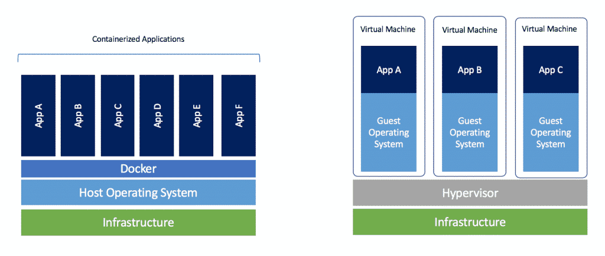

## 虚拟机

虚拟机是模拟计算机。你可以配置一个客户虚拟机，安装某些操作系统和配置，并在不影响你的宿主环境的情况下使用它。

在这门课中，你可以使用虚拟机来实验操作系统、软件和配置，而无风险：你不会影响到你的主要开发环境。

通常，虚拟机有很多用途。它们常用于运行只能在特定操作系统上运行的软件（例如，在 Linux 上使用 Windows 虚拟机运行特定于 Windows 的软件）。它们经常被用来实验可能有恶意的软件。

### 有用的特性

- **隔离性**：虚拟机管理程序在隔离宿主和客户系统方面做得相当好，所以你可以相对安全地使用虚拟机运行有缺陷或不可信的软件。

- **快照**：你可以为你的虚拟机拍摄“快照”，捕获整个机器状态（磁盘、内存等），对你的机器进行更改，然后恢复到较早的状态。这对于测试潜在的破坏性行动等事情非常有用。

### 缺点

虚拟机通常比在裸机上运行要慢，因此对于某些应用来说可能不适用。

### 设置

- **资源**：与宿主机共享；在分配物理资源时要意识到这一点。

- **网络**：有许多选项，默认的 NAT 对大多数用例应该足够好。

- **客户端附加组件**：许多虚拟机管理程序可以在客户系统中安装软件，以实现与宿主系统更好的集成。如果你可以，应该使用这个。

### 资源

- 虚拟机管理程序
  - [VirtualBox](https://www.virtualbox.org/)（开源）
  - [Virt-manager](https://virt-manager.org/)（开源，管理 KVM 虚拟机和 LXC 容器）
  - [VMWare](https://www.vmware.com/)（商业软件，MIT 学生可以通过 IS&T 获得[VMware Fusion](https://ist.mit.edu/vmware-fusion)）

如果你已经熟悉流行的虚拟机管理程序/虚拟机，你可能会想了解更多关于如何以命令行友好的方式进行操作。一个选项是[libvirt](https://wiki.libvirt.org/page/UbuntuKVMWalkthrough)工具包，它允许你管理多种不同的虚拟化提供商/虚拟机管理程序。

### 练习

1. 下载并安装一个虚拟机管理程序。

1. 创建一个新的虚拟机并安装一个 Linux 发行版（例如[Debian](https://www.debian.org/)）。

1. 尝试使用快照。尝试你一直想尝试的事情，比如运行`sudo rm -rf --no-preserve-root /`，并看看是否能够轻松恢复。

1. 阅读什么是[叉炸弹](https://en.wikipedia.org/wiki/Fork_bomb)（`:(){ :|:& };:`），并在虚拟机上运行它，以查看资源隔离（CPU、内存等）是否有效。

1. 安装客户端附加组件并尝试不同的窗口模式、文件共享和其他特性。

---

<iframe src="https://www.youtube.com/embed/LJ9ki5zq6Ik" frameborder="0" allowfullscreen></iframe>

## 容器

相对于虚拟机来说，虚拟机是相对重量级的；如果你想以自动化的方式快速启动机器怎么办？这就是容器的用武之地！

- Amazon Firecracker
- Docker
- rkt
- lxc

容器**大多**只是各种 Linux 安全特性的组合，比如虚拟文件系统、虚拟网络接口、chroots、虚拟内存技巧等等，这些共同提供了虚拟化的外观。

虚拟机并不像 VM 那样安全或隔离，但相当接近并且越来越好。通常性能更高，启动速度更快，但并非总是如此。

性能提升来自于与虚拟机运行完整的操作系统副本不同，容器与宿主共享 Linux 内核。但请注意，如果你在 Windows/macOS 上运行 Linux 容器，需要在两者之间激活 Linux 虚拟机作为中间层。

_Docker 容器与虚拟机的比较。图片来源：blog.docker.com_

当你想在标准化的设置中运行自动化任务时，容器很方便：

- 构建系统
- 开发环境
- 预打包服务器
- 运行不受信任的程序
  - 评分学生提交
  - （一些）云计算
- 持续集成
  - Travis CI
  - GitHub Actions

此外，像 Docker 这样的容器软件也被广泛用作解决[依赖地狱](https://en.wikipedia.org/wiki/Dependency_hell)的方案。如果一台机器需要运行许多具有冲突依赖的服务，它们可以使用容器隔离。

通常，你会写一个文件来定义如何构建你的容器。你从一些最小的**基础镜像**开始（比如 Alpine Linux），然后列出一系列命令来设置你想要的环境（安装包、复制文件、构建东西、写配置文件等）。通常，还有一种方式可以指定任何外部端口应该可用，以及一个**入口点**，它规定了当容器启动时应运行什么命令（比如一个评分脚本）。

类似于代码仓库网站（如[GitHub](https://github.com/)），也有一些容器仓库网站（如[DockerHub](https://hub.docker.com/)）可以轻松部署许多软件服务的预构建镜像。

### 练习

1. 选择一个容器软件（Docker、LXC、……）并安装一个简单的 Linux 镜像。尝试 SSH 连接到它。

1. 搜索并下载一个流行的 web 服务器（nginx、apache、……）的预构建容器镜像。
