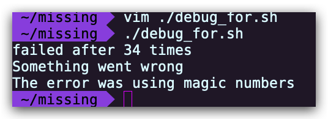

1. 阅读 man ls ，然后使用ls 命令进行如下操作：
    * 所有文件（包括隐藏文件） ：`-a`
    * 文件打印以人类可以理解的格式输出 (例如，使用454M 而不是 454279954) : `-h`
    * 文件以最近访问顺序排序：`-t`
    * 以彩色文本显示输出结果`--color=auto`  
    典型输出如下：
    ```bash
    -rw-r--r--   1 user group 1.1M Jan 14 09:53 baz
    drwxr-xr-x   5 user group  160 Jan 14 09:53 .
    -rw-r--r--   1 user group  514 Jan 14 06:42 bar
    -rw-r--r--   1 user group 106M Jan 13 12:12 foo
    drwx------+ 47 user group 1.5K Jan 12 18:08 ..
    ```
2. 编写两个bash函数  marco 和 polo 执行下面的操作。 每当你执行 marco 时，当前的工作目录应当以某种形式保存，当执行 polo 时，无论现在处在什么目录下，都应当 cd 回到当时执行 marco 的目录。 为了方便debug，你可以把代码写在单独的文件 marco.sh 中，并通过 source marco.sh命令，（重新）加载函数。通过source 来加载函数，随后可以在 bash 中直接使用。
    ```bash
    #!/bin/bash
    marco(){
        echo "$(pwd)" > $HOME/marco_history.log
        echo "save pwd $(pwd)"
    }
    polo(){
        cd "$(cat "$HOME/marco_history.log")"
    }
    ```
    或者
    ```bash
    #!/bin/bash
    marco() {
        export MARCO=$(pwd)
    }
    polo() {
        cd "$MARCO"
    }
    ```
    
3. 假设您有一个命令，它很少出错。因此为了在出错时能够对其进行调试，需要花费大量的时间重现错误并捕获输出。 编写一段bash脚本，运行如下的脚本直到它出错，将它的标准输出和标准错误流记录到文件，并在最后输出所有内容。 加分项：报告脚本在失败前共运行了多少次。
    ```bash 
    #!/usr/bin/env bash

    n=$(( RANDOM % 100 ))

    if [[ n -eq 42 ]]; then
        echo "Something went wrong"
        >&2 echo "The error was using magic numbers"
        exit 1
    fi

    echo "Everything went according to plan"
    ```

    使用 while 循环完成
    ```bash
    #!/usr/bin/env bash
    count=0
    echo > out.log

    while true
    do
        ./buggy.sh &>> out.log
        if [[ $? -ne 0 ]]; then
            cat out.log
            echo "failed after $count times"
            break
        fi
        ((count++))

    done

    ```
    使用 for 循环完成
    ```bash
    #!/usr/bin/env bash
    echo > out.log
    for ((count=0;;count++))
    do
        ./buggy.sh &>> out.log
        if [[ $? -ne 0 ]]; then
            echo "failed after $count times"
            break

        fi
    done

    ```
    使用 until 完成
    ```bash
    #!/usr/bin/env bash
    count=0
    ./buggy.sh &>> out.log
    until [[ "$?" -ne 0 ]];
    do
        count=$((count+1))
        ./buggy.sh &>> out.log
    done

    echo "failed after $count runs"

    ```
    执行测试脚本debug.sh,并验证脚本结果的正确性
    ```bash
    ~$ ./debug.sh
    failed after 34 times
    ~$ cat out.log | grep Everything | wc -l
    34
    ```
    

4. 本节课我们讲解的 find 命令中的 -exec 参数非常强大，它可以对我们查找的文件进行操作。
    如果我们要对所有文件进行操作呢？例如创建一个zip压缩文件？我们已经知道，命令行可以从参数或标准输入接受输入。在用管道连接命令时，我们将标准输出和标准输入连接起来，但是有些命令，例如tar 则需要从参数接受输入。这里我们可以使用[xargs](https://man7.org/linux/man-pages/man1/xargs.1.html) 命令，它可以使用标准输入中的内容作为参数。 例如 ls | xargs rm 会删除当前目录中的所有文件。您的任务是编写一个命令，它可以递归地查找文件夹中所有的HTML文件，并将它们压缩成zip文件。注意，即使文件名中包含空格，您的命令也应该能够正确执行（提示：查看 xargs的参数-d）*译注：MacOS 上的 xargs没有-d，查看这个[issue](https://github.com/missing-semester/missing-semester/issues/93)*

    如果您使用的是 MacOS，请注意默认的 BSD find 与[GNU coreutils](https://en.wikipedia.org/wiki/List_of_GNU_Core_Utilities_commands) 中的是不一样的。你可以为find添加-print0选项，并为xargs添加-0选项。作为 Mac 用户，您需要注意 mac 系统自带的命令行工具和 GNU 中对应的工具是有区别的；如果你想使用 GNU 版本的工具，也可以使用 [brew](https://formulae.brew.sh/formula/coreutils) 来安装。

      1. 首先创建所需的文件
     ```bash
     mkdir html_root
     cd html_root
     touch {1..10}.html
     mkdir html
     cd html
     touch xxxx.html
     ```
     ```bash
     ├── html_root
     │   ├── 1.html
     │   ├── 10.html
     │   ├── 2.html
     │   ├── 3.html
     │   ├── 4.html
     │   ├── 5.html
     │   ├── 6.html
     │   ├── 7.html
     │   ├── 8.html
     │   ├── 9.html
     │   └── html
     │       └── xxxx.html
     ```
      1. 执行 find 命令  
     ```bash
     #for MacOS
     find html_root -name "*.html" -print0 | xargs -0 tar vcf html.zip
     ```
     ```bash
     #for Linux
     find . -type f -name "*.html" | xargs -d '\n'  tar -cvzf html.zip
     ```
     ```bash
     a html_root/9.html
     a html_root/5.html
     a html_root/4.html
     a html_root/8.html
     a html_root/3.html
     a html_root/html/xxxx.html
     a html_root/2.html
     a html_root/1.html
     a html_root/10.html
     a html_root/7.html
     a html_root/6.html
     ```

5. (进阶) 编写一个命令或脚本递归的查找文件夹中最近使用的文件。更通用的做法，你可以按照最近的使用时间列出文件吗？
`find . -type f -print0 | xargs -0 ls -lt | head -1`


当文件数量较多时，上面的解答会得出错误结果，解决办法是增加 `-mmin `条件，先将最近修改的文件进行初步筛选再交给ls进行排序显示
 `find . -type f -mmin -60 -print0 | xargs -0 ls -lt | head -10`

