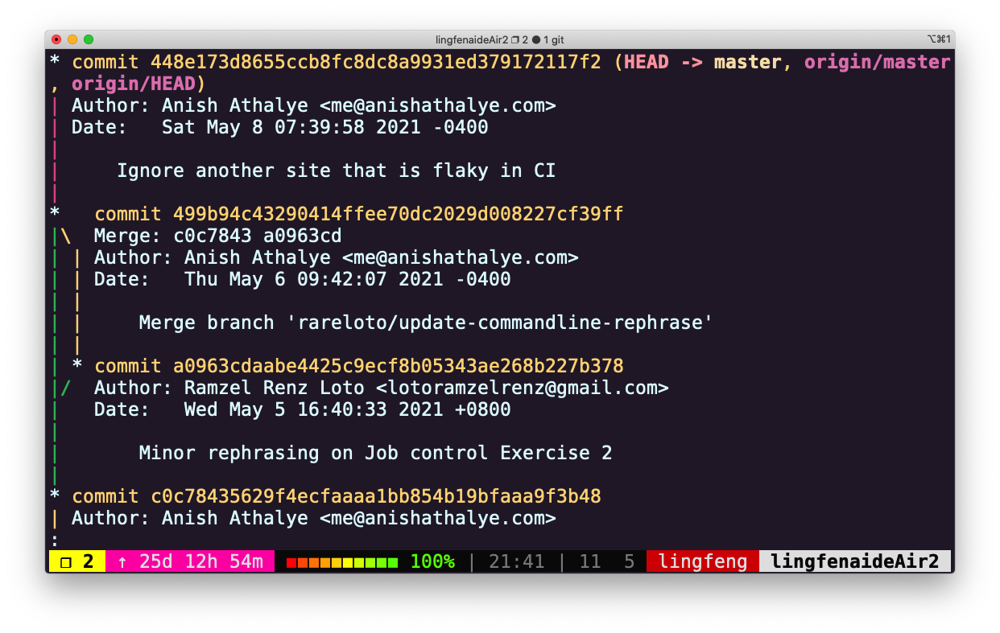
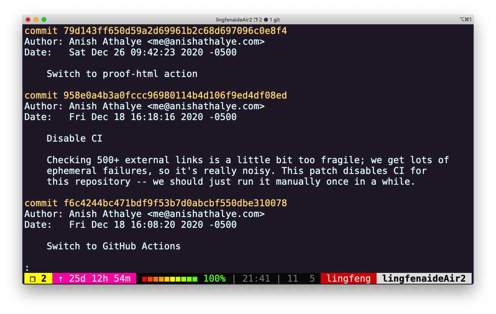
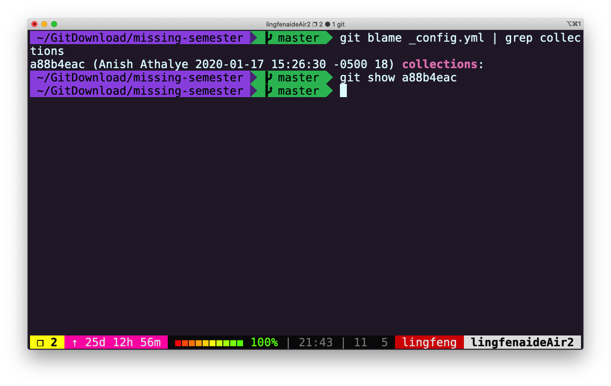
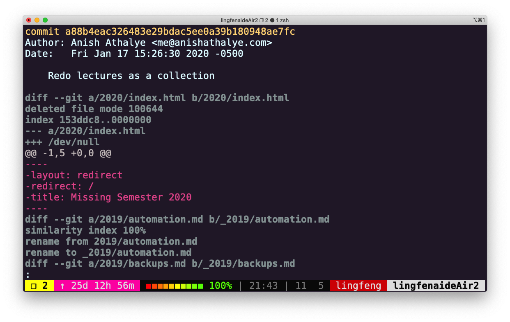
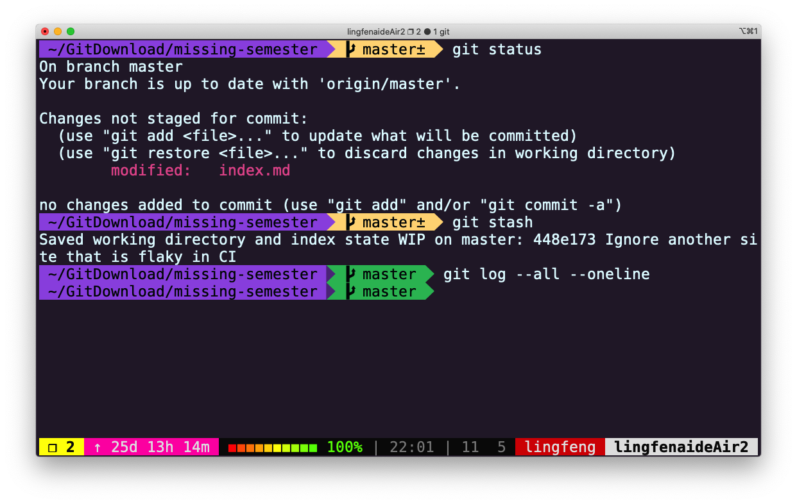
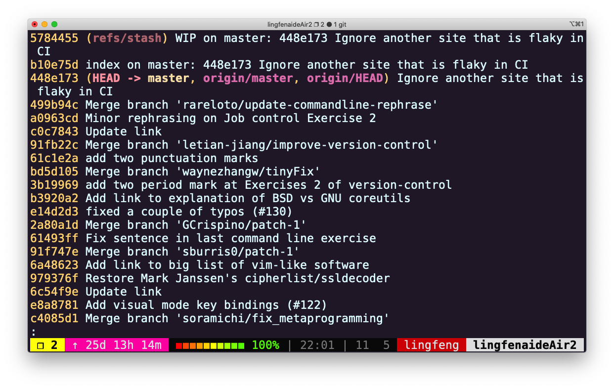
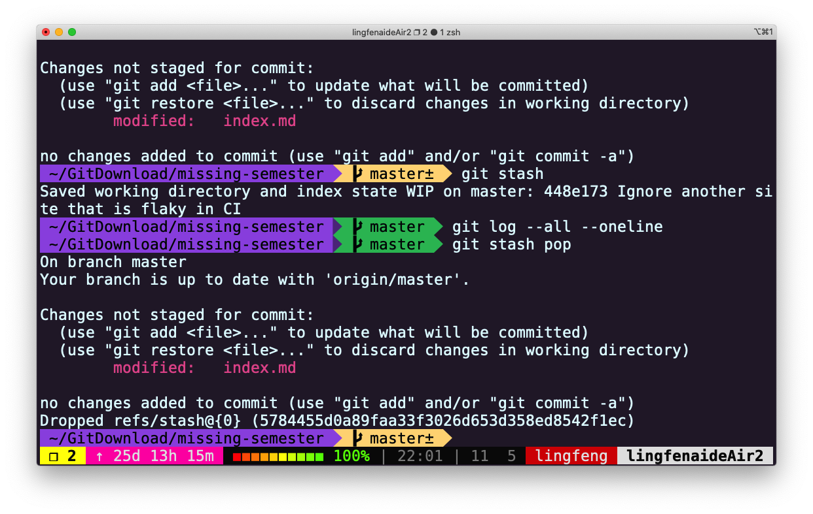
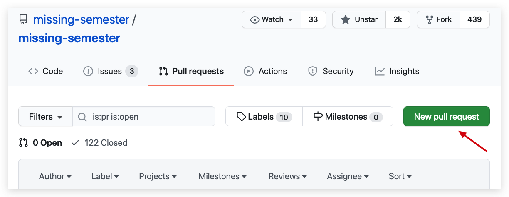

1. 如果您之前从来没有用过 Git，推荐您阅读 Pro Git 的前几章，或者完成像 Learn Git Branching这样的教程。重点关注 Git 命令和数据模型相关内容；

1. Fork 本课程网站的仓库

1. 将版本历史可视化并进行探索
    ```bash
    git log --all --graph --decorate
    ```
    

1. 是谁最后修改了 README.md文件？（提示：使用 git log 命令并添加合适的参数）
    ```bash
    git log -1 README.md
    ```
    * `-x` 选项：查看最新的 x 次提交或特定文件的版本信息
    

1. 最后一次修改_config.yml 文件中 collections: 行时的提交信息是什么？（提示：使用 git blame 和 git show）
    ```bash
    git blame _config.yml | grep collections
    ```
    
    ```bash
    git show --pretty=format:"%s" a88b4eac | head -1
    ```
    或者，使用git log命令
    ```bash
    git log --pretty=format:"%s" a88b4eac -1
    ```
    

1. 使用 Git 时的一个常见错误是提交本不应该由 Git 管理的大文件，或是将含有敏感信息的文件提交给 Git 。尝试向仓库中添加一个文件并添加提交信息，然后将其从历史中删除 ( 这篇文章也许会有帮助)；

1. 首先提交一些敏感信息
    ```bash
    echo "password123">my_password
    git add .
    git commit -m "add password123 to file"
    git log HEAD
    ```
    

1. 使用`git filter-branch`清除提交记录
    ```bash
    git filter-branch --force --index-filter\
    'git rm --cached --ignore-unmatch ./my_password' \
    --prune-empty --tag-name-filter cat -- --all
    ```
    文件已经删除
    
    提交记录已经删除
    

1. 从 GitHub 上克隆某个仓库，修改一些文件。当您使用 git stash 会发生什么？当您执行 git log --all --oneline 时会显示什么？通过 git stash pop 命令来撤销 git stash 操作，什么时候会用到这一技巧？
    
    
    
    
	- 接下来，将在视频展示的demo仓库上展示stash操作
    ```shell
    ~/gits/demo (main?) $ git graph
    * a735daf (HEAD -> main) Change the print functions
    - 9d983c7 Merge branch 'dog'
    |\
    | * aa83cee (dog) Add dog functionality
    * | 077e2a0 (cat) Add cat functionality
    |/
    * ce1d2f0 Add animal.py
    * ba821e1 Add another line
    * 1547103 Create demo for learning git commands
    ```
	- 创建新文件，添加到暂存区后，将其存入stash存储列表
    ```shell
    ~/gits/demo (main?) $ echo 'new file' > file.txt
    ~/gits/demo (main?) $ git add file.txt
    ~/gits/demo (main+?) $ git status
    On branch main
    Changes to be committed:
      (use "git restore --staged <file>..." to unstage)
            new file:   file.txt

     # 将暂存区的file.txt存到stash
    ~/gits/demo (main+) $ git stash save "create file.txt"
    Saved working directory and index state On main: create file.txt
    ```
	- 查看stash存储的内容
    ```shell
     # 列出所有的存储，按照git stash的执行顺序依次从0开始编号
     # 每份存储对应的编号，就是stash@{}中的数字
    ~/gits/demo (main) $ git stash list
    stash@{0}: On main: create file.txt

     # git stash show默认显示第一份存储，也可以指定要显示的存储
    ~/gits/demo (main) $ git stash show
     file.txt | 1 +
     1 file changed, 1 insertion(+)
    ~/gits/demo (main) $ git stash show stash@{0}
     file.txt | 1 +
     1 file changed, 1 insertion(+)
    ```
	- 执行`git stash`后，添加到暂存区的内容不会再提示需要提交(Changes to be committed)。而且，尽管执行`git stash`使得提交记录新增了两项，但是可以发现`HEAD`引用并没有变动。
    ```shell
    ~/gits/demo (main) $ git status
    On branch main
    nothing to commit, working tree clean

    ~/gits/demo (main) $ git graph
    - 27e9528 (refs/stash) On main: create file.txt
    |\
    | * 108018a index on main: a735daf Change the print functions
    |/
    * a735daf (HEAD -> main) Change the print functions
    - 9d983c7 Merge branch 'dog'
    |\
    | * aa83cee (dog) Add dog functionality
    * | 077e2a0 (cat) Add cat functionality
    |/
    * ce1d2f0 Add animal.py
    * ba821e1 Add another line
    * 1547103 Create demo for learning git commands
    ```
	- 从main分支切换到dog分支，再将存储恢复，然后提交，这时，我们刚才新建的file.txt,变成了dog分支下的一次新提交。
    ```shell
    ~/gits/demo (main) $ git checkout dog
    Switched to branch 'dog'
    ~/gits/demo (dog) $ git stash pop
    On branch dog
    Changes to be committed:
      (use "git restore --staged <file>..." to unstage)
            new file:   file.txt

    Dropped refs/stash@{0} (27e95285da3d0bad0c2a452238628dd893e623b7)
     # 该命令会删除原来的存储stash@{0}，并在当前分支dog下恢复暂存区文件file.txt
    ~/gits/demo (dog+) $ git status
    On branch dog
    Changes to be committed:
      (use "git restore --staged <file>..." to unstage)
            new file:   file.txt

    ~/gits/demo (dog+) $ git commit -m 'Add file.txt on branch dog'
    [dog 19b71ce] Add file.txt on branch dog
     1 file changed, 1 insertion(+)
     create mode 100644 file.txt

    ~/gits/demo (dog) $ git graph
    * 19b71ce (HEAD -> dog) Add file.txt on branch dog
    | * a735daf (main) Change the print functions
    | - 9d983c7 Merge branch 'dog'
    | |\
    | |/
    |/|
    * | aa83cee Add dog functionality
    | * 077e2a0 (cat) Add cat functionality
    |/
    * ce1d2f0 Add animal.py
    * ba821e1 Add another line
    * 1547103 Create demo for learning git commands
    ```
    - 当我们将改动添加到暂存区（`git add`）后，通过执行`git stash`后，可以自由地切换到其他分支（注意：在暂存区存有改动时，切换分支(`checkout`)是不被允许的）
    - 另外，运用`stash`和`stash pop`，可以自由选择 _stash存储的改动_ 即将提交到的分支（本例中，将原本应该在main分支下提交的记录移动到了dog分支下进行提交）

1. 与其他的命令行工具一样，Git 也提供了一个名为 ~/.gitconfig 配置文件 (或 dotfile)。请在 ~/.gitconfig 中创建一个别名，使您在运行 git graph 时，您可以得到 git log --all --graph --decorate --oneline 的输出结果；
    ```bash
    [alias]
        graph = log --all --graph --decorate --oneline
    ```

1. 您可以通过执行 git config --global core.excludesfile ~/.gitignore_global 在 ~/.gitignore_global 中创建全局忽略规则。配置您的全局 gitignore 文件来自动忽略系统或编辑器的临时文件，例如 .DS_Store；
    ```bash
    git config --global core.excludesfile ~/.gitignore .DS_Store
    ```

1. 克隆 本课程网站的仓库，找找有没有错别字或其他可以改进的地方，在 GitHub 上发起拉取请求（Pull Request）；
    首先 fork 本网站仓库，然后克隆 fork 后的仓库
    ```bash
    git clone https://github.com/hanxiaomax/missing-semester.git
    ```
    在本地进行修改后，提交到 fork 后的仓库，然后[发起 PR](https://github.com/missing-semester/missing-semester/pulls)

    
